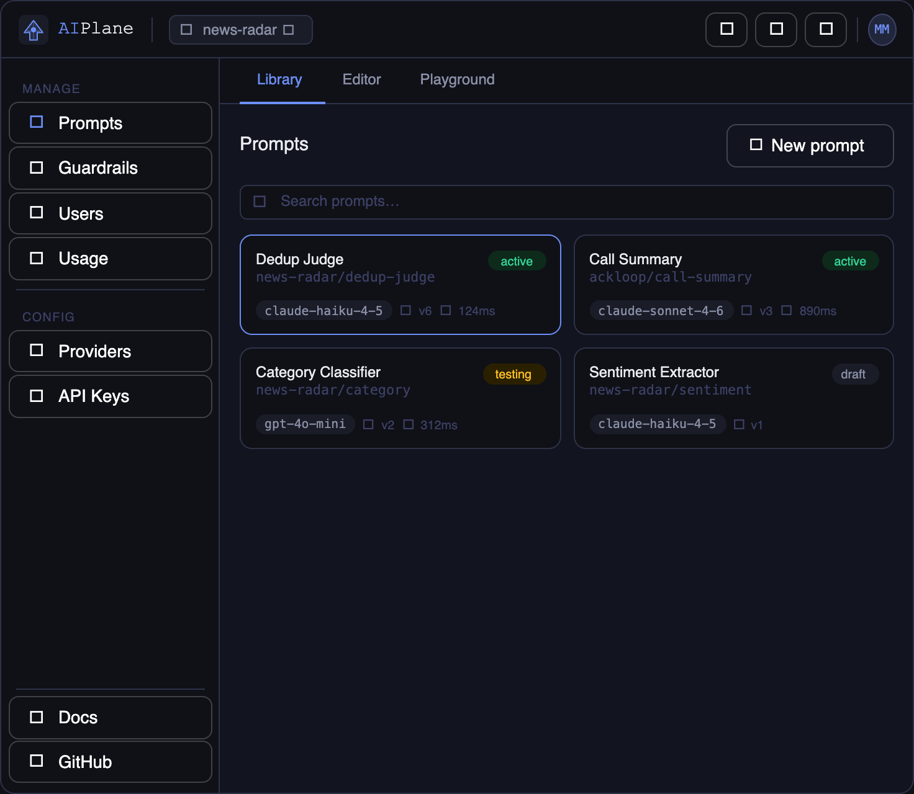

  

<h1 align="center">Queriva</h1>

  
  

<strong>Ask your data anything.</strong>

Self-hosted, LLM-powered semantic search. Ingest documents from any source,
search in natural language, get AI-synthesized answers — zero external API calls.

  

> **Status:** Implementation in progress. See [`docs/SPEC.md`](docs/SPEC.md)
> for architecture and [`docs/ISSUES.md`](docs/ISSUES.md) for the backlog.

## Docs

- [`docs/SPEC.md`](docs/SPEC.md) — full specification
- [`docs/ISSUES.md`](docs/ISSUES.md) — implementation backlog
- [`docs/adr/`](docs/adr/) — architecture decision records
- [`CHANGELOG.md`](CHANGELOG.md) — version history

Full README coming at v1.0.0 — see [`README-TEMPLATE.md`](README-TEMPLATE.md).
